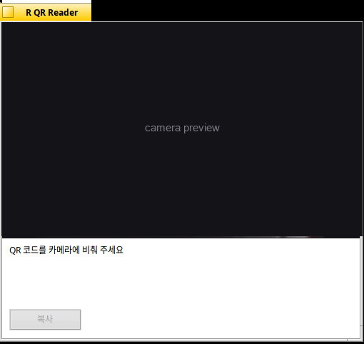

# R QR Reader for Haiku OS

[한국어](README.ko.md)

Reads QR codes with the webcam. Hold a code up to the camera; a web address offers to open in the browser, anything else is shown and can be copied.



*The camera view is masked out; it would otherwise show whatever the camera happens to be pointed at.*

## Requirements

Haiku (x86 or x86_64) and a UVC webcam. Build it on the machine you are going to run it on — no cross-compiler needed.

Also builds and runs on arm64, cross-compiled against the Haiku kits; it needs nothing outside them.

## Install with pkgman

| Haiku | Commands |
| --- | --- |
| 32-bit x86 (x86_gcc2) | `pkgman add-repo https://pkgman.rainygirl.com/x86_gcc2`<br>`pkgman install rqrreader` |
| arm64 | `pkgman add-repo http://pkgman.rainygirl.com/arm64`<br>`pkgman install rqrreader` |

Then start **R QR Reader** from Deskbar -> Applications.

If `pkgman add-repo` fails with `Operation not supported`, the network kit of that image has no TLS; use `http://` instead of `https://` in the address.

## Install from source

```sh
./install.sh
```

This compiles it, puts the binary in `~/config/non-packaged/apps/`, adds it to **Deskbar → Applications**, and puts a link on the Desktop.

```sh
./install.sh --build-only   # compile in place, install nothing
./install.sh --uninstall    # remove it again
```

## Using it

Scanning runs continuously; there is no start or stop. A result stays on screen until a **different** code is read.

- **A web address** — a dialog offers to open it in the browser.
- **Anything else** — a dialog shows the text.
- **Copy** puts the result on the clipboard.

Codes are read tilted, rotated, blurred, on dark backgrounds and mirrored. Supported: versions 1 to 10 (21×21 up to 57×57), error correction levels L/M/Q/H, and the numeric, alphanumeric and byte modes. Kanji mode, ECI, structured append and Micro QR are not implemented.

## License

MIT

## AI disclosure

This program was written with Claude.
